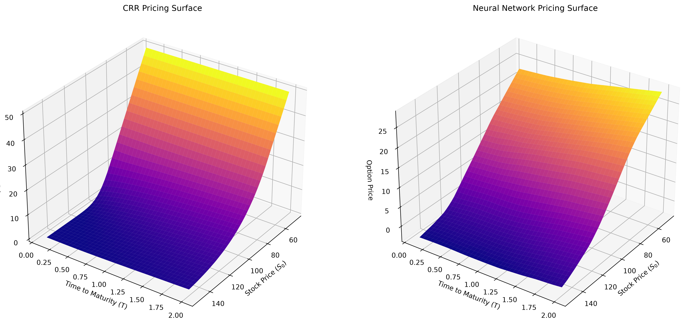

# 📈 Deep Learning for American Put Option Pricing

  

**Combining classical quantitative finance with modern deep learning to solve one of the core problems in derivatives pricing.**
> *A 9-week structured project — from options fundamentals to a trained RL agent that learns when to exercise.*
## 🧠 What This Project Does
American options are harder to price than European ones because they can be exercised **at any time before expiry** — making it an **optimal stopping problem**. This project builds and compares three approaches to solve it:
| Approach | Method | What it learns |
|---|---|---|
| 📐 Classical | Binomial Tree (CRR) | Baseline prices via backward induction |
| 🤖 ML | Neural Network | Approximates the pricing function |
| 🎮 RL | Reinforcement Learning | Learns *when* to exercise optimally |

## 🗓️ Project Roadmap

### Phase 1 — Foundations (Weeks 1–4)
| Week | Topic | Key Concepts |
|------|-------|-------------|
| 1 | **Basics of Options** | Calls, puts, American vs European, payoff intuition |
| 2 | **Black-Scholes Model** | Inputs, European pricing, why it breaks for American |
| 3 | **Binomial Model** | CRR tree, backward induction, early exercise |
| 4 | **Code the Baseline** | American put via binomial, plots, exercise boundary |

### Phase 2 — Machine Learning (Weeks 5–6)
| Week | Topic | Key Concepts |
|------|-------|-------------|
| 5 | **Intro to ML** | Regression, loss functions, simple neural nets |
| 6 | **NN on Synthetic Data** | Train a network to match binomial prices |

### Phase 3 — Reinforcement Learning (Weeks 7–9)
| Week | Topic | Key Concepts |
|------|-------|-------------|
| 7 | **Reinforcement Learning** | State, action, reward; exercise vs hold |
| 8 | **Train the RL Agent** | Policy vs binomial benchmark |
| 9 | **Compare & Ship** | Binomial vs NN vs RL, final report, repo polish |

---

## 🛠️ Tech Stack

## 📊 Key Deliverables

- **Binomial pricer** with early exercise boundary visualization
- **Neural network** that approximates option prices from market inputs
- **RL agent** that learns an exercise policy end-to-end
- **Final comparison report**: accuracy, speed, and interpretability of all three methods

## 📚 References

- Hull, J. C. — *Options, Futures, and Other Derivatives*
- Longstaff & Schwartz (2001) — *Valuing American Options by Simulation*
- Sutton & Barto — *Reinforcement Learning: An Introduction*
